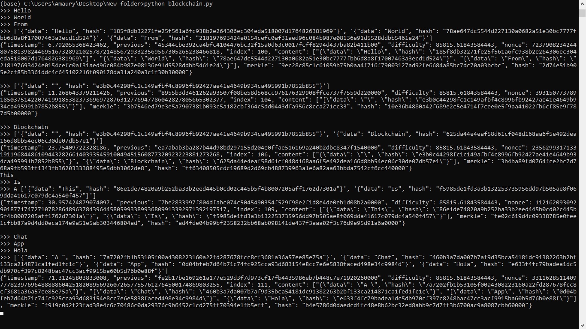

# Chat Chain

This project implements a simple blockchain structure to represent a chat channel, where each message is encapsulated within a block in the chain.

## Table of Contents

- [Introduction](#introduction)
- [Project Structure](#project-structure)
- [Installation](#installation)
- [Usage](#usage)
- [Configuration](#configuration)
- [Testing](#testing)
- [License](#license)

## Introduction

The objective of this project is to create a basic blockchain that functions as a chat channel. Each message sent in the chat is stored as a block in the blockchain, ensuring the integrity and chronological order of messages.

## Project Structure

The repository contains the following files:

- `block.py`: Defines the `Block` class, representing a single block in the blockchain.
- `blockchain.py`: Contains the `Blockchain` class, managing the chain of blocks.
- `message.py`: Defines the `Message` class, representing the content of a chat message.
- `config.py`: Contains configuration settings for the blockchain.
- `test.py`: Provides examples and test cases for the `Block` and `Message` classes.
- `resources.py`: Contains additional resources used in the project.
- `output.jpg`: An example output image demonstrating the expected result.
- `.gitignore`: Specifies files and directories to be ignored by Git.
- `LICENSE`: The MIT License file for the project.
- `README.md`: This readme file.

## Installation

To set up the project locally, follow these steps:

1. **Clone the Repository**:

   ```bash
   git clone https://github.com/lorainemg/chat-block.git
   cd chat-block
   ```
2. Ensure Python 3.x is Installed: The project is implemented in Python.

## Usage
1. Run the Test Script:

The `test.py` file contains examples of how to use the Block and Message classes. You can run this script to see the blockchain in action:

```bash
python test.py
```
2. Expected Output:

The output should resemble the example provided in.

## Configuration
The `config.py` file contains settings that define the behavior of the blockchain. You can adjust these configurations as needed to fit your requirements.

## Testing
The `test.py` script includes test cases demonstrating the usage of the Block and Message classes. Run this script to verify that your implementation works as expected.
